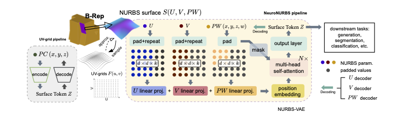

## NeuroNURBS
[](https://arxiv.org/abs/2411.10848)
Official Implementation of our Paper "[NeuroNURBS: Learning Efficient Surface Representations for 3D Solids](https://arxiv.org/abs/2411.10848)".



## Note
This code builds on the previous work "[BrepGen: A B-rep Generative Diffusion Model with Structured Latent Geometry](https://arxiv.org/abs/2401.15563)".


## Environment 
conda create -n p39 python==3.9.2
conda init
conda activate p39
conda install -c conda-forge lambouj::occwl
conda install pytorch==2.2.2 torchvision==0.17.2 torchaudio==2.2.2 pytorch-cuda=11.8 -c pytorch -c nvidia
pip install -r requirements.txt
conda install -c conda-forge pytorch3d::pytorch3d
# conda install 'numpy<2.0'  

## Citation
If you find our work useful in your research, please cite the following paper
```
@misc{fan2024neuronurbslearningefficientsurface,
      title={NeuroNURBS: Learning Efficient Surface Representations for 3D Solids}, 
      author={Jiajie Fan and Babak Gholami and Thomas Bäck and Hao Wang},
      year={2024},
      eprint={2411.10848},
      archivePrefix={arXiv},
      primaryClass={cs.CV},
      url={https://arxiv.org/abs/2411.10848}, 
}
```
