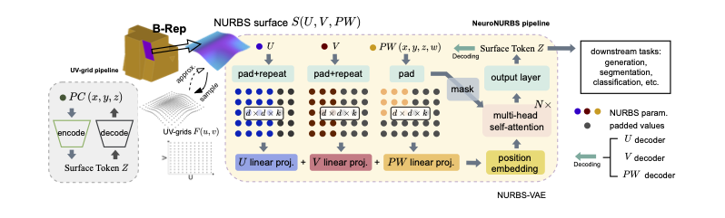

# NeuroNURBS

[](https://arxiv.org/abs/2411.10848)
[](https://www.python.org/downloads/)
[](https://pytorch.org/)
[](LICENSE)

Official implementation of **"NeuroNURBS: Learning Efficient Surface Representations for 3D Solids"**.



## Overview

Boundary Representation (B-Rep) is the de facto standard for 3D solids in Computer-Aided Design (CAD). B-Rep solids consist of NURBS (Non-Uniform Rational B-Splines) surfaces forming a closed volume.

Existing approaches rely on the **UV-grid approximation** — uniformly sampling points on each surface — which is memory-intensive and imprecise. **NeuroNURBS** directly encodes the NURBS surface parameters, achieving:

| Metric | UV-Grid | NeuroNURBS | Improvement |
|---|---|---|---|
| GPU consumption (training) | baseline | — | **↓ 86.7%** |
| Memory (storing 3D solids) | baseline | — | **↓ 79.9%** |
| BrepGen FID | 30.04 | **27.24** | **↑ better** |

NeuroNURBS also resolves the **undulating surface** artifact common in UV-grid-based generation.

## Repository Structure

```
NeuroNURBS/
├── data_process/           # Data preprocessing scripts
│   ├── process_brep.py     # Parse STEP files → NURBS parameters
│   ├── convert_utils.py    # OpenCASCADE conversion utilities
│   ├── deduplicate.sh      # Shell script for deduplication
│   ├── deduplicate_cad.py  # Remove duplicate CAD models
│   └── deduplicate_surfedge.py
├── helpers/
│   ├── construct_nurbs.py  # NURBS surface construction
│   └── utils/              # OpenCASCADE utility wrappers
│       ├── occ_face.py
│       ├── occ_edge.py
│       ├── occ_solid.py
│       └── ...
├── tests/                  # Unit tests
├── network.py              # VAE network architecture
├── trainer.py              # Training loops (SurfVAETrainer, EdgeVAETrainer)
├── dataset.py              # PyTorch Dataset classes
├── vae.py                  # Training entry point
├── utils.py                # Shared utilities and argument parsing
├── train_vae.sh            # Training launch scripts
├── requirements.txt        # Pip dependencies
└── pyproject.toml          # Project metadata and tool configuration
```

## Installation

### Prerequisites

- Conda (recommended via [Miniforge](https://github.com/conda-forge/miniforge))
- CUDA 11.8 compatible GPU

### Step-by-step

```bash
# 1. Create and activate conda environment
conda create -n neuronurbs python=3.9.2
conda activate neuronurbs

# 2. Install OpenCASCADE wrapper (occwl)
conda install -c conda-forge lambouj::occwl

# 3. Install PyTorch with CUDA 11.8
conda install pytorch==2.2.2 torchvision==0.17.2 torchaudio==2.2.2 \
    pytorch-cuda=11.8 -c pytorch -c nvidia

# 4. Install Python dependencies
pip install -r requirements.txt

# 5. (Optional) Install PyTorch3D for evaluation metrics
conda install -c conda-forge pytorch3d::pytorch3d
```

### Development install

```bash
pip install -e ".[dev]"
pre-commit install
```

## Data Preparation

NeuroNURBS is evaluated on:
- **DeepCAD** — ~170k CAD models
- **ABC** — large-scale CAD dataset
- **Furniture** — domain-specific fine-tuning

### Processing pipeline

```bash
# 1. Parse B-Rep STEP files into NURBS parameters
cd data_process
bash process.sh

# 2. Deduplicate the dataset
bash deduplicate.sh

# 3. The processed data will be stored under data_process/<dataset>_parsed/
```

The processed data directory should follow this structure:
```
data_process/
└── deepcad_parsed/
    ├── 00000000.pkl
    ├── 00000001.pkl
    └── ...
```

## Training

### Surface VAE

```bash
python vae.py \
    --data data_process/deepcad_parsed \
    --option surface \
    --max_ctrlPts 10 \
    --max_kv 10 \
    --batch_size 512 \
    --train_list data_process/deepcad_data_split_6bit_surface.pkl \
    --val_list data_process/deepcad_data_split_6bit.pkl \
    --train_nepoch 800 \
    --test_nepoch 20 \
    --save_nepoch 50 \
    --gpu 0 \
    --env deepcad_vae_surf \
    --data_aug
```

Or use the provided script:

```bash
bash train_vae.sh
```

### Edge VAE

```bash
python vae.py \
    --data data_process/deepcad_parsed \
    --option edge \
    --train_list data_process/deepcad_data_split_6bit_edge.pkl \
    --val_list data_process/deepcad_data_split_6bit.pkl \
    --train_nepoch 400 \
    --gpu 0 \
    --env deepcad_vae_edge \
    --data_aug
```

### Fine-tuning on a new dataset

```bash
python vae.py \
    --data data_process/furniture_parsed \
    --option surface \
    --finetune \
    --weight proj_log/deepcad_vae_surf.pt \
    --train_nepoch 200 \
    --gpu 0 \
    --env furniture_vae_surf
```

## Key Arguments

| Argument | Default | Description |
|---|---|---|
| `--data` | required | Path to parsed data directory |
| `--option` | required | `surface` or `edge` |
| `--batch_size` | 512 | Training batch size |
| `--train_nepoch` | 800 | Number of training epochs |
| `--max_ctrlPts` | 10 | Max NURBS control points per dimension |
| `--max_kv` | 10 | Max knot vector length |
| `--gpu` | 0 | GPU device id(s) |
| `--env` | required | Experiment name for wandb logging |
| `--finetune` | False | Fine-tune from a pretrained checkpoint |
| `--weight` | — | Path to pretrained checkpoint (for fine-tuning) |
| `--data_aug` | False | Enable data augmentation |

## Monitoring

Training metrics are logged via [Weights & Biases](https://wandb.ai). To view:

```bash
wandb login
# metrics appear at https://wandb.ai/<your-entity>/NurbsGen
```

## Citation

If you find this work useful, please cite:

```bibtex
@misc{fan2024neuronurbslearningefficientsurface,
    title   = {NeuroNURBS: Learning Efficient Surface Representations for 3D Solids},
    author  = {Jiajie Fan and Babak Gholami and Thomas Bäck and Hao Wang},
    year    = {2024},
    eprint  = {2411.10848},
    archivePrefix = {arXiv},
    primaryClass  = {cs.CV},
    url     = {https://arxiv.org/abs/2411.10848},
}
```

## Acknowledgements

This code builds on [BrepGen: A B-rep Generative Diffusion Model with Structured Latent Geometry](https://arxiv.org/abs/2401.15563). We thank the authors for open-sourcing their work.

## License

This project is licensed under the MIT License — see [LICENSE](LICENSE) for details.
Portions of the code derived from BrepGen are licensed under the GPL — see [LICENSE_GPL](LICENSE_GPL).
